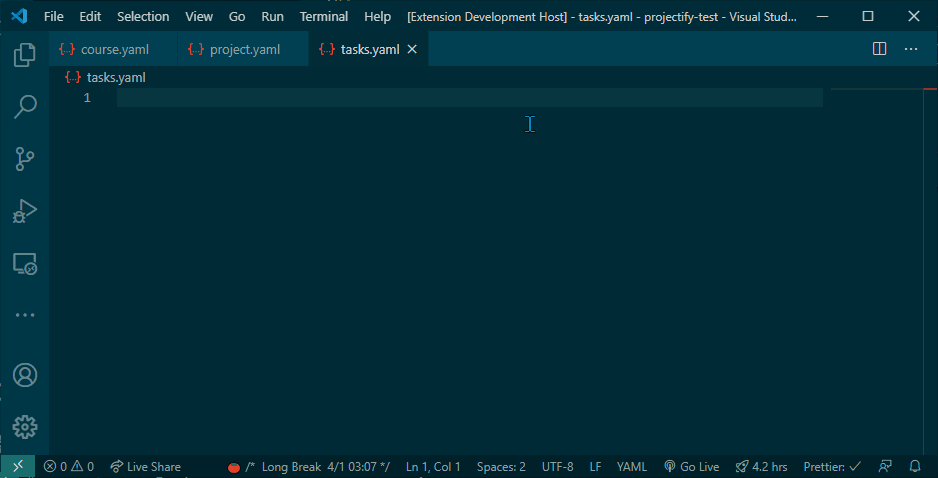
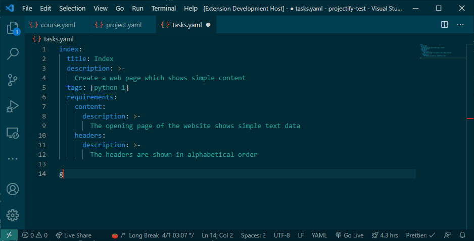

# Projectify

Developing curriculum in Codecool is not the simplest thing to do as a mentor.
With this code snippet collection I would like to help to make easier and more pleasant to create new content in our curriculum.

> Before you dive into creating new projects please investigate our [projectify guide](https://codecool.atlassian.net/wiki/spaces/WOR/pages/982450199/Guide+How+to+create+projects+in+the+curriculum+Projectify)

## Features

### `project.yaml`

* `proj-meta`: generating `project.yaml` body

### `tasks.yaml`

* `task`: creates a task with all necessary attributes
* `req`: creates a requirement for a task
* `general`: creates GENERAL requirement block



#### General tasks



### `course.yaml`

* `group`: generates a group node
* `proj`: generates a project node
* `tut`: generates a tutorial node, id automatically parsed to label
* `mile`: generates a milestone node, id automatically parsed to label


> You can read more about the different types of building blocks in course.yaml in our `[Guide: How to build and update a course in Journey](https://codecool.atlassian.net/wiki/spaces/WOR/pages/1276706892/Guide+How+to+build+and+update+a+course+in+Journey+technical+quide#Group)`

### Inside markdown files

* `comps`: creates competencies block
* `link-yt`: youtube link with thumbnail image
* `link-in`: inner link reference to our materials, icon type selectable
* `link-out`: outer link
* `link-vid`: video link
* `if-lang`: Project language switch in case of multi-language projects
* `img`: image
* `code`: Syntax highlighted code block
* `uml`: basic plant uml template for class diagram
* `quiz`: creates an empty quiz without questions
* `quiz-q`: question template inside a a quiz block
* `tutorial`: generates a skeleton for a tutorial page

## Installation

1. Clone the repository
2. Open a terminal
3. Navigate to the repo folder
4. Run the following command:

    `code --install-extension projectify-1.1.1.vsix`

5. Restart your VS Code

---

## Contribution

If you want to change this extension please first read the corresponding documentation about VS Code extensions:

* [Your first extension](https://code.visualstudio.com/api/get-started/your-first-extension)
* [Snippet guide](https://code.visualstudio.com/api/language-extensions/snippet-guide)
* [Code snippet detailed guide](https://www.freecodecamp.org/news/definitive-guide-to-snippets-visual-studio-code/)

### Version update and packaging

If you feel that you are good to go live follow these steps:

1. [ ] Update pacage.json version number
2. [ ] Update CHANGELOG.md
3. [ ] Update README.md if needed (e.g. new feature)
4. [ ] Delete previous vsix package
5. [ ] Generate new package by running the following command

    ```shell
    vsce package --githubBranch=main
    ```

    > We need the github-branch option because our default branch in `main`
